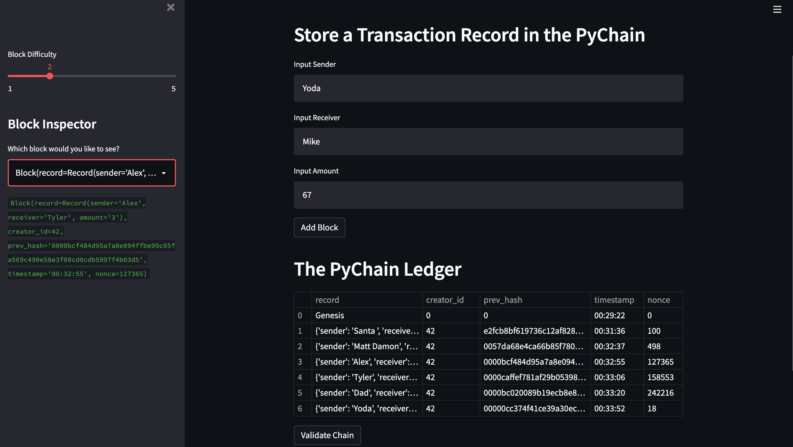
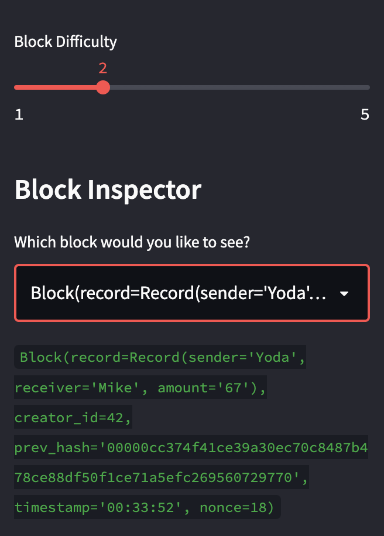
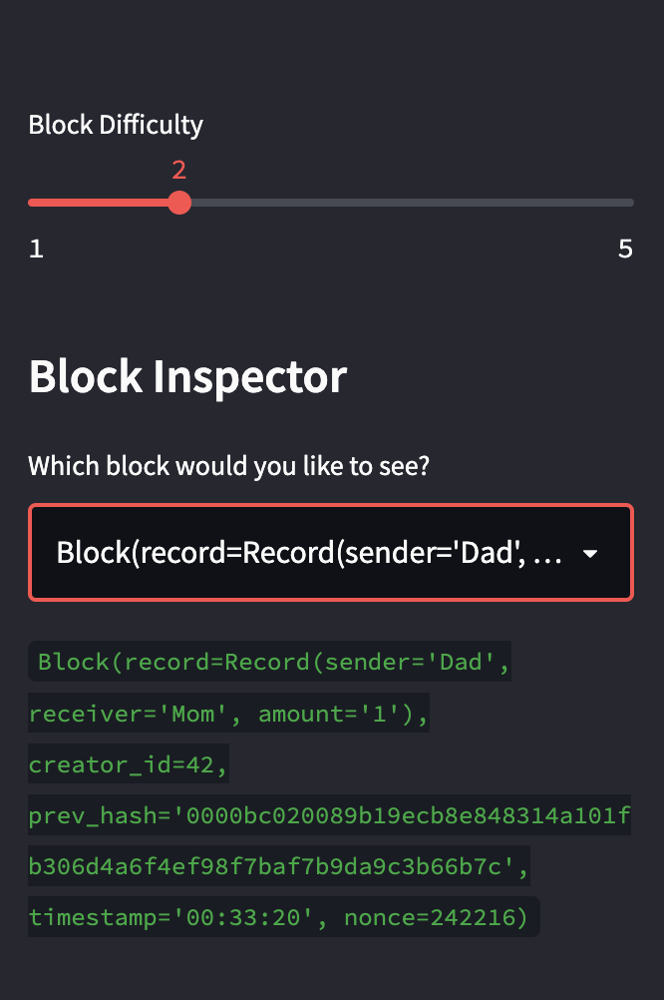
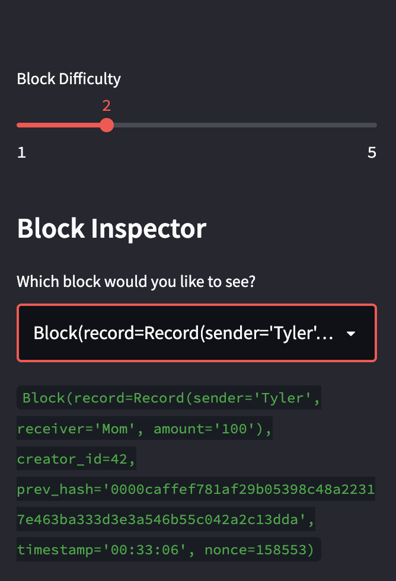
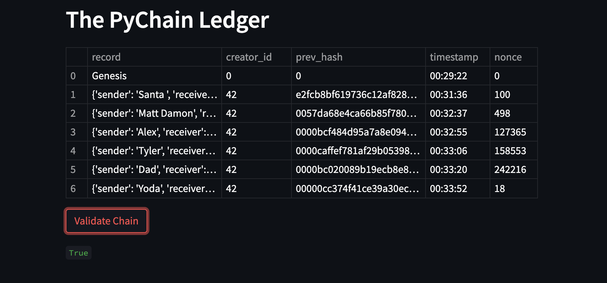

## Blockchain
# PyChain Ledger

---
# My streamlit application:
You can input a receiver, a sender, and an amount which would then create a new block under 'The Pychain Ledger' with various attributes like record, timestamp, prev_hash, and nouce.
You are able create as many blocks as you would like, and can validate the blockchain at the bottom of the application via the button 'Validate Chain'.
The left hand side of this application allows you to inspect each block and allows you to view and verify the contents and hashes of the blocks you created.

To run this application use the terminal and you need to navigate where this python file (pychain.py) is stored on your computer. Then run 'streamlit run pychain.py' on your terminal, and you would be able to see the following images (these will vary depending on the information you input on application): 

# Verifying the block contents and hashes in the Streamlit dropdown menu.

# Testing the blockchain validation process by using the web interface

